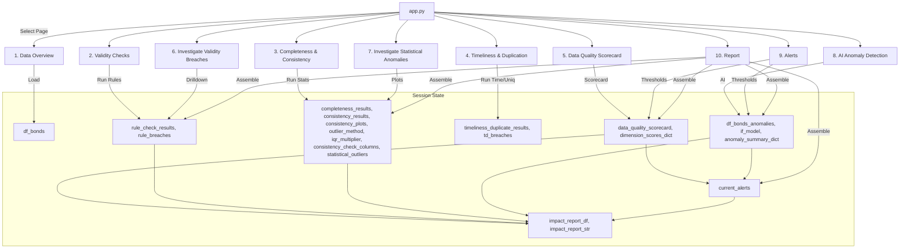

id: 69384caf472b65d9d1c9a3d6_documentation
summary: Data Quality Evaluator Documentation
feedback link: https://docs.google.com/forms/d/e/1FAIpQLSfWkOK-in_bMMoHSZfcIvAeO58PAH9wrDqcxnJABHaxiDqhSA/viewform?usp=sf_link
environments: Web
status: Published
# QuLab: AI-Driven Data Quality Scorecard for Corporate Bond Data

## 1. Overview, Goals, and Key Concepts
Duration: 5:00

Welcome to QuLab — a Streamlit application that guides a Quantitative Analyst through an end-to-end, AI-assisted data quality workflow for corporate bond datasets. The app demonstrates how to operationalize checks across completeness, validity, consistency, timeliness, uniqueness, and AI-based anomaly detection and aggregate these into a transparent, weighted scorecard ready for business decisions.

What you will learn:
- How to simulate and load a realistic multi-bond, multi-date dataset with intentional quality issues.
- How to apply business policy checks (validity), missingness and outlier checks (completeness and consistency), temporal checks (timeliness) and key uniqueness checks.
- How to consolidate results into a weighted data quality scorecard and produce a management-ready impact report.
- How to use AI anomaly detection (Isolation Forest via PyOD) to uncover multivariate anomalies beyond simple rules.
- How to extend the app with new rules, metrics, and alerts.

Why this app matters:
- Production-grade ML systems in finance depend on high-integrity time series to produce reliable, auditable, and fair results.
- This lab provides a reproducible pattern to institutionalize data quality beyond ad-hoc scripts.
- It bridges business policy, statistical checks, and AI in one coherent workflow.

<aside class="positive">
This codelab translates data quality principles into practical, auditable steps. Each page in the app mirrors a real decision point in a Quant/DataOps workflow.
</aside>

## 2. Setup and Run
Duration: 4:00

### Prerequisites
- Python 3.9+ recommended
- OS: macOS, Linux, or Windows
- Internet access to fetch packages

### Install dependencies
```console
python -m venv .venv
source .venv/bin/activate   # On Windows: .venv\Scripts\activate
pip install --upgrade pip
pip install streamlit pandas numpy matplotlib seaborn scikit-learn pyod missingno
```

### Start the app
```console
streamlit run app.py
```

### Project structure (high-level)
```console
.
├── app.py
├── application_pages/
│   ├── page_1_data_overview.py
│   ├── page_2_validity_checks.py
│   ├── page_3_completeness_consistency.py
│   ├── page_4_timeliness_duplication.py
│   ├── page_5_scorecard.py
│   ├── page_6_investigate_validity.py
│   ├── page_7_investigate_statistical.py
│   ├── page_8_ai_anomaly.py
│   ├── page_9_alerts.py
│   └── page_10_report.py
└── utils.py
```

<aside class="negative">
If you see import errors for PyOD or missingno, confirm the virtual environment is active and packages are correctly installed.
</aside>

## 3. Architecture and Data Flow
Duration: 6:00

QuLab uses modular Streamlit pages orchestrated by app.py. Shared state is passed through st.session_state, and core logic resides in utils.py.

### Component roles
- app.py: App entry, navigation, and session reset.
- application_pages/: UI flows organized by task/step.
- utils.py: Dataset generation, checks, scoring, AI models, reporting.

### State orchestration and dependencies
- Producers: Each page computes results and writes to st.session_state.
- Consumers: Downstream pages read previously computed results.



## 4. Page 1: Data Overview
Duration: 5:00

Purpose: Load a synthetic corporate bond panel with intentional data quality issues and quickly scan structure and descriptive stats.

Key function:
```python
# utils.py
def generate_and_load_corporate_bond_data(start_date='2010-01-01', end_date='2019-12-31', num_bonds=10, filename='corporate_bond_data.csv', random_state=42) -> pd.DataFrame:
    ...
    return pd.read_csv(filename, parse_dates=['Date','Maturity_Date'])
```

What it simulates:
- Daily panel data for multiple bonds.
- Controlled missingness in critical fields: Volume, Rating, Risk_Score, Index_Value, Coupon_Rate.
- Intentional duplicates and timeliness gaps to mirror real-world ingestion issues.

How to use in the UI:
- Click “Load Corporate Bond Data”.
- Inspect df.head(), df.info(), and df.describe().

<aside class="positive">
Tip: Use this step to choose which checks to prioritize later (e.g., if Rating has unexpected categories, tighten the validity rule).
</aside>

## 5. Page 2: Validity Checks (Business Rules)
Duration: 6:00

Purpose: Encode business and regulatory policies as rule-based checks to prevent obvious errors from contaminating modeling.

Core function:
```python
# utils.py
def check_validity_rules(df: pd.DataFrame, rules: dict):
    """
    rules structure:
    {
      'coupon_rate_range': {'enabled': True, 'min': 0.01, 'max': 0.10},
      'risk_score_positive': {'enabled': True, 'min': 0.0},
      'rating_categories': {'enabled': True, 'allowed': [...]},
      'volume_non_negative': {'enabled': True, 'min': 0.0},
      'maturity_future': {'enabled': True}
    }
    """
    ...
    return results_df, breached_records
```

UI actions:
- Toggle rules and set parameters.
- Click “Run Validity Checks”.
- Review results in a table; breaches are also stored for drill-down in Step 8.

Policy examples rendered as math:
- $0.01 \leq \text{Coupon Rate} \leq 0.10$
- $\text{Risk Score} \geq 0.0$
- $\text{Volume} \geq 0.0$
- $\text{Maturity Date} > \text{Date}$

Outputs to session state:
- rule_check_results
- rule_breaches

<aside class="negative">
Be careful with overly tight ranges. Legit business scenarios might be flagged as breaches if you do not account for market regimes.
</aside>

## 6. Page 3: Completeness & Consistency
Duration: 7:00

Purpose: Quantify missingness (completeness) and detect univariate outliers (consistency) using statistical thresholds aligned to your tolerance.

Core function:
```python
# utils.py
def check_completeness_and_consistency(df, completeness_cols, consistency_cols, outlier_method='IQR', iqr_multiplier=3.0):
    ...
    return completeness_df, consistency_df, outlier_records, figures
```

Outlier methods:
- IQR: For a value $x$, it is an outlier if $x < Q1 - k \cdot IQR$ or $x > Q3 + k \cdot IQR$, where $IQR = Q3 - Q1$.
- Z-Score: Outliers if $|z| > 3$ with $z = \frac{x - \mu}{\sigma}$.

UI steps:
- Select columns for completeness and consistency checks.
- Choose outlier method: IQR or Z-Score.
- Adjust IQR multiplier $k$ (higher $k$ flags only extreme outliers).
- Click “Run Statistical Checks”.
- Review completeness and consistency tables and distribution plots.

Outputs to session state:
- completeness_results
- consistency_results
- statistical_outliers
- consistency_plots
- consistency_check_columns
- outlier_method
- iqr_multiplier

<aside class="positive">
For financial data with heavy tails, start with IQR and a higher $k$ (e.g., 3.0) to avoid tagging legitimate rare events as errors.
</aside>

## 7. Page 4: Timeliness & Duplication
Duration: 5:00

Purpose: Ensure chronological integrity and uniqueness for time series modeling.

Core function:
```python
# utils.py
def check_timeliness_and_duplicates(df, date_col='Date', id_cols=None):
    ...
    return results_df, breaches
```

UI steps:
- Specify date column and unique key columns.
- Click “Run Timeliness & Duplicate Checks”.
- Review metrics and sample records of duplicates and missing dates.

Outputs to session state:
- timeliness_duplicate_results
- td_breaches

<aside class="negative">
Even a few duplicate key collisions can bias backtests and inflates apparent data density. Investigate and deduplicate before training.
</aside>

## 8. Page 5: Data Quality Scorecard
Duration: 6:00

Purpose: Aggregate all checks into a single, weighted score that supports a go/no-go decision and defensible documentation.

Core class:
```python
# utils.py
class DataQualityScorer:
    def __init__(self, weights=None): ...
    def generate_scorecard(self, completeness_df, validity_df, consistency_df, timeliness_duplicate_df):
        ...
        return scorecard_df, scores
```

Scoring:
- Dimension score: $s_i = \max(0, 1 - \frac{\text{Breach Percentage}_i}{100})$
- Overall weighted score:
  $$ S_{overall} = \frac{\sum_{i=1}^{N} s_i \cdot w_i}{\sum_{i=1}^{N} w_i} $$

UI steps:
- Tune dimension weights (e.g., validity might be more important than timeliness).
- Click “Generate Data Quality Scorecard”.
- Review table and bar chart with overall score overlay.

Outputs to session state:
- data_quality_scorecard
- dimension_scores_dict

<aside class="positive">
Weights make the scorecard contextual. For pre-trade risk, give higher weight to validity and uniqueness; for macro research, timeliness may matter more.
</aside>

## 9. Page 6: Investigate Validity Breaches
Duration: 5:00

Purpose: Drill into specific records behind rule breaches for evidence-based remediation.

Core helpers:
```python
# utils.py
def summarize_rule_breaches(rule_check_results, breached_records) -> pd.DataFrame: ...
def get_breach_sample(breached_records, rule_name: str, n: int = 5) -> pd.DataFrame: ...
```

UI steps:
- Review breach summary sorted by breach percentage.
- Select a breached rule and sample size.
- Click “Show Sample Records” to see concrete cases.

Inputs required:
- rule_check_results
- rule_breaches

<aside class="positive">
Use sampled records to validate upstream fixes or justify model-time filters with audit-ready examples.
</aside>

## 10. Page 7: Investigate Statistical Anomalies
Duration: 6:00

Purpose: Visualize distributions, missingness patterns, and outlier boundaries to inform pre-processing.

Core helpers:
```python
# utils.py
def summarize_statistical_issues(completeness_df, consistency_df) -> pd.DataFrame: ...
def plot_outlier_distribution(df, outlier_records, column_name, method='IQR', iqr_multiplier=3.0) -> Figure: ...
```

UI steps:
- Inspect the combined summary of missingness and outliers.
- View missingness matrix (missingno).
- Select a numeric column and click “Plot Outlier Distribution” to overlay bounds.

Inputs required:
- completeness_results
- consistency_results
- df_bonds
- outlier_method, iqr_multiplier, consistency_check_columns

<aside class="negative">
If you routinely see broad distribution shifts or persistent tails, consider robust scalers, transformations, or segmentation by regime.
</aside>

## 11. Page 8: AI Anomaly Detection
Duration: 7:00

Purpose: Catch non-obvious, multivariate anomalies with Isolation Forest.

Core function:
```python
# utils.py
from pyod.models.iforest import IForest as IsolationForest

def apply_ai_anomaly_detection(df, features_for_anomaly_detection, contamination_rate=0.015, random_state=42):
    ...
    return df_out, model, summary
```

UI steps:
- Pick features (e.g., Index_Value, Volume, Coupon_Rate, Risk_Score).
- Set contamination rate (expected anomaly fraction).
- Click “Run AI Anomaly Detection”.
- Review anomaly counts and plots:
  - Histogram of anomaly scores (colored by anomaly flag)
  - Time series of anomaly scores with flagged points

Outputs to session state:
- df_bonds_anomalies
- if_model
- anomaly_summary_dict

<aside class="positive">
AI detection complements rule checks. It’s particularly useful post-remediation to verify that subtle inconsistencies are not creeping in.
</aside>

## 12. Page 9: Alerts Configuration & Status
Duration: 5:00

Purpose: Convert the analysis into proactive guardrails via thresholds.

Core function:
```python
# utils.py
def check_for_critical_alerts(dimension_scores, data_quality_scorecard, anomaly_summary, overall_score_threshold=0.75, completeness_score_threshold=0.80, validity_score_threshold=0.80, ai_anomaly_percentage_threshold=2.0):
    ...
    return alerts
```

UI steps:
- Set thresholds for overall score, completeness score, validity score, and AI anomaly percentage.
- Click “Check for Critical Alerts”.
- Alerts are displayed inline.

Outputs to session state:
- current_alerts

<aside class="negative">
Thresholds that are too lenient won’t catch drift, while thresholds that are too strict can cause alert fatigue. Tune by backtesting on historical runs.
</aside>

## 13. Page 10: Data Quality Impact Report
Duration: 5:00

Purpose: Produce a concise, management-ready report that summarizes current data quality health and recommended actions.

Core function:
```python
# utils.py
def generate_data_quality_impact_report(scorecard, rule_check_results, statistical_issues_summary, anomaly_summary, current_alerts):
    ...
    return report_df, report_string
```

UI steps:
- Click “Generate Impact Report”.
- View the markdown narrative and a tabular export-ready summary.

Inputs:
- data_quality_scorecard
- summarized validity and statistical issues
- anomaly_summary_dict
- current_alerts

<aside class="positive">
Embed the report in change management workflows to capture sign-offs, remediation owners, and due dates.
</aside>

## 14. Key APIs and Extensibility
Duration: 7:00

Add a new business rule:
```python
# utils.py
def check_validity_rules(df, rules):
    ...
    if rules.get('price_positive', {}).get('enabled', False):
        mask = (df['Price'] <= 0) | df['Price'].isna()
        breaches = df[mask]
        count = len(breaches)
        pct = 100.0 * count / len(df) if len(df) else 0.0
        results.append({'Rule': 'Price Positive', 'Column': 'Price', 'Breach_Count': count, 'Breach_Percentage': pct, 'Status': 'PASS' if count==0 else 'FAIL'})
        if count:
            breached_records['price_positive'] = breaches
```

Add a new dimension to the scorecard:
- Compute a breach percentage for the new dimension.
- Add a weight in DataQualityScorer.__init__.
- Include the dimension in generate_scorecard’s score and average breach computation.

Add a new page:
```python
# application_pages/page_11_custom_check.py
import streamlit as st
def main():
    st.header('11. Custom Check')
    st.markdown('Describe your new check and its outputs.')
    # your logic here
```
```python
# app.py (navigation and routing)
pages = [..., '11. Custom Check']
elif page == '11. Custom Check':
    from application_pages.page_11_custom_check import main
    main()
```

Persist extra artifacts:
- Use st.session_state['your_key'] = your_value
- Display with st.dataframe, st.pyplot, or st.download_button

## 15. Formulas and Thresholds Reference
Duration: 3:00

- Completeness percentage on column $c$: $\frac{\#\text{missing in } c}{\#\text{rows}} \times 100$
- IQR Outlier rule for $x$: $x < Q1 - k \cdot IQR$ or $x > Q3 + k \cdot IQR$, where $IQR = Q3 - Q1$
- Z-Score Outlier rule: $|z| = \left|\frac{x - \mu}{\sigma}\right| > 3$
- Dimension score: $s_i = 1 - \frac{\text{Breach Percentage}_i}{100}$
- Overall score: $S_{overall} = \frac{\sum_{i=1}^{N} s_i \cdot w_i}{\sum_{i=1}^{N} w_i}$

## 16. Troubleshooting and Tips
Duration: 4:00

- Nothing displays on downstream pages
  - Ensure you ran upstream steps; many pages depend on session_state keys.
- Slow plots on large datasets
  - Consider downsampling or filtering before plotting; the app already subsamples long time series for anomaly score plots.
- AI anomalies all zero or all one
  - Review features and contamination rate. Too few features or poorly scaled distributions can skew results. The app standardizes inputs via StandardScaler.
- Reproducibility
  - Most random operations set random_state=42. Adjust as needed for experiments.

<aside class="positive">
Automate this pipeline in CI to guard model training data. Persist the scorecard and alerts per run to a data quality registry or dashboard.
</aside>

## 17. Appendix: Selected Code Snippets
Duration: 6:00

Generate and load data:
```python
from utils import generate_and_load_corporate_bond_data
df = generate_and_load_corporate_bond_data()
```

Run validity checks:
```python
from utils import check_validity_rules
rules = {
    'coupon_rate_range': {'enabled': True, 'min': 0.01, 'max': 0.10},
    'risk_score_positive': {'enabled': True, 'min': 0.0},
    'rating_categories': {'enabled': True, 'allowed': ['AAA','AA','A','BBB','BB','B','CCC','CC','C','D']},
    'volume_non_negative': {'enabled': True, 'min': 0.0},
    'maturity_future': {'enabled': True}
}
validity_df, breaches = check_validity_rules(df, rules)
```

Completeness and consistency:
```python
from utils import check_completeness_and_consistency
comp_df, cons_df, outliers, figs = check_completeness_and_consistency(
    df,
    completeness_cols=['Volume','Rating','Risk_Score','Index_Value','Coupon_Rate'],
    consistency_cols=['Index_Value','Volume','Coupon_Rate','Risk_Score'],
    outlier_method='IQR',
    iqr_multiplier=3.0
)
```

Timeliness and duplicates:
```python
from utils import check_timeliness_and_duplicates
td_df, td_breaches = check_timeliness_and_duplicates(df, date_col='Date', id_cols=['Bond_ID','Date'])
```

Scorecard:
```python
from utils import DataQualityScorer
dq = DataQualityScorer(weights={'completeness':0.25,'validity':0.35,'consistency':0.20,'timeliness':0.10,'uniqueness':0.10})
scorecard_df, scores = dq.generate_scorecard(comp_df, validity_df, cons_df, td_df)
```

AI anomaly detection:
```python
from utils import apply_ai_anomaly_detection
df_anom, model, summary = apply_ai_anomaly_detection(df, ['Index_Value','Volume','Coupon_Rate','Risk_Score'], contamination_rate=0.015)
```

Alerts:
```python
from utils import check_for_critical_alerts
alerts = check_for_critical_alerts(scores, scorecard_df, summary, overall_score_threshold=0.75, completeness_score_threshold=0.80, validity_score_threshold=0.80, ai_anomaly_percentage_threshold=2.0)
```

Report:
```python
from utils import generate_data_quality_impact_report, summarize_rule_breaches, summarize_statistical_issues
rule_summary = summarize_rule_breaches(validity_df, breaches)
stat_summary = summarize_statistical_issues(comp_df, cons_df)
report_df, report_str = generate_data_quality_impact_report(scorecard_df, rule_summary, stat_summary, summary, alerts)
print(report_str)
```

You have now explored the entire QuLab workflow and can adapt it to your data and governance needs.
